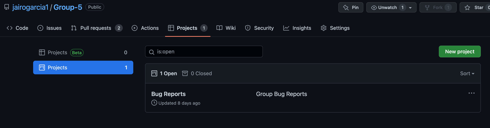

# Assignment 6: Test Your Group's Project 
## Step 1 before running Super-linter create a Pull Request 
 
 
## Step 2 click "Details" in the pull request box to see the process of Super-linter or in this case the errors that caused all checks to fail 
 
 
  
 
 ## Step 3 go through the report and make a note for errors that were found 
  
 
 ## Step 4 create a GitHub Project and call it Bug Report 
  
 
 
  
 
 ## Step 5 make notes under "Needs triage" for each error found by Super-linter 
  
 
 ## Step 6 assign the notes to the respective priority box and fix any other errors especially the high priority ones 
  
 
 
 ## Step 7 fix the errors found with Super-linter (fixed the misspelled hyperlink tag in line 120) 
  
 
  
 
 
  ## Step 8 after fixing the errors in the file, edit the note you found by adding a report stating any changes/fixes 
  
 
 
 ## Step 9 run-lint one last time if the job completes you're good to merge. If it doesn't pass all checks address any other errors. 
  
 
 
 ## Step 10 the final step is to merge the pull request 
  
 

 
