  # Assignment 8: Managing a Specific Change 
## Use "git pull" to update your local repository with the latest version of the group's project (see example below) 
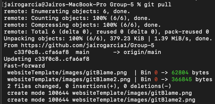 
 

## Make a branch with "git branch" 
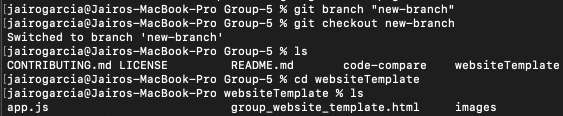 
## and modify at least one file from the group's project. (adding a button and new paragraph tag) 
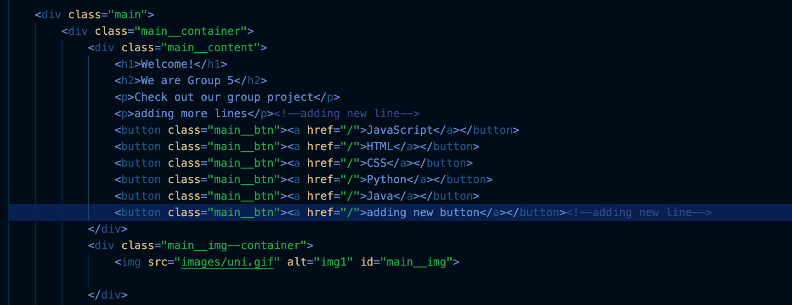 
 

## Run a diff command (git diff) to document what is different between your version of the file and the previous version (see example below) 
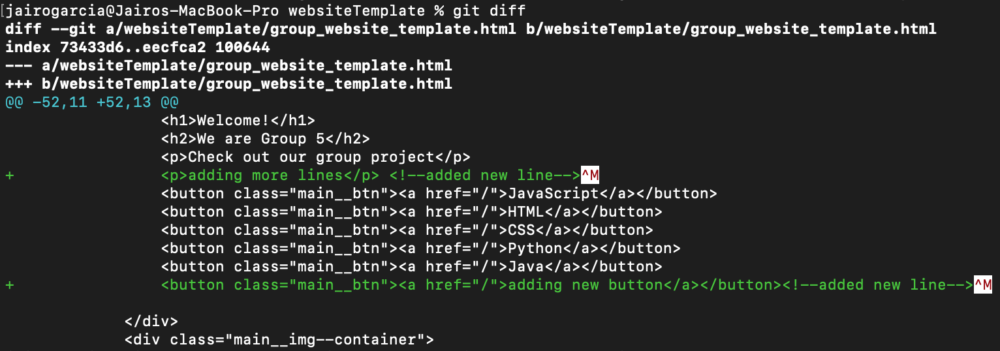 
 

## Merge your change into the group's project. Step 1 use "git add" (see example below)  
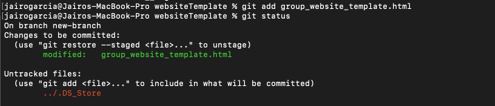 
 

## Step 2 commit. Use "git commit"(see example below)  
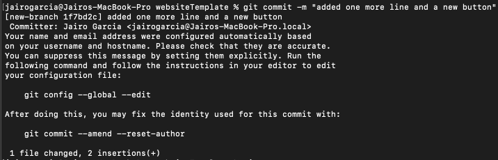 
 

## Step 3 merge to main (switch to the main branch and use "git merge")(see example below)  
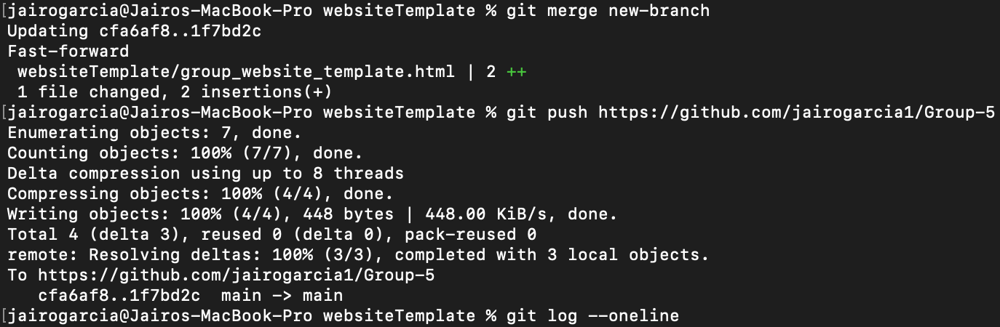 
 

## Step 4 push to remote repo. Use "git push"(see example below)  
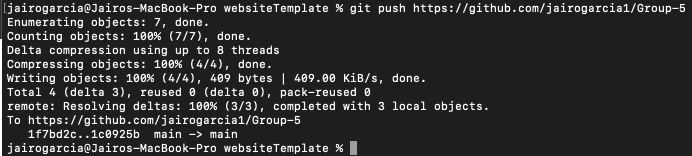 
 

## Step 5 check log. Use "git log" (see example below)  
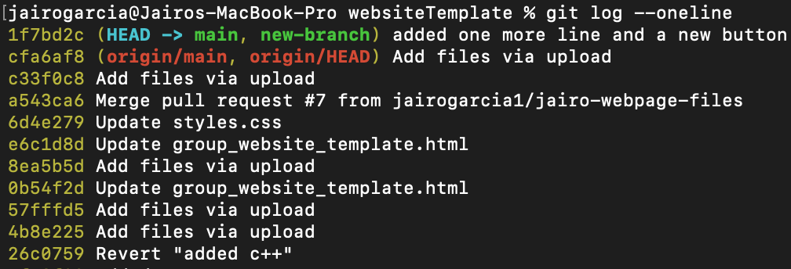 
 

## Finally, reverse your changes. Use "git revert" command (see example below)  
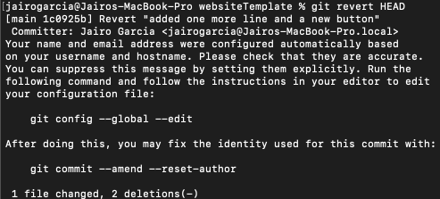 
 
## Check log one last time to confirm reversed changes (see example below)  
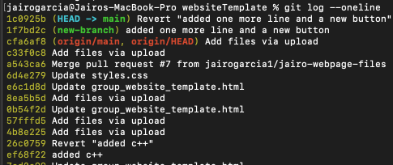 
 
