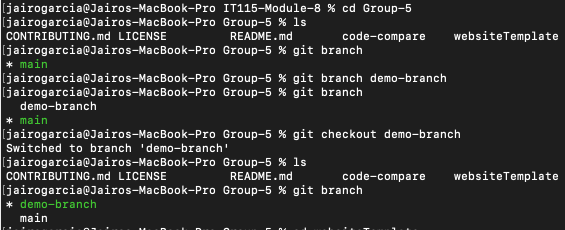
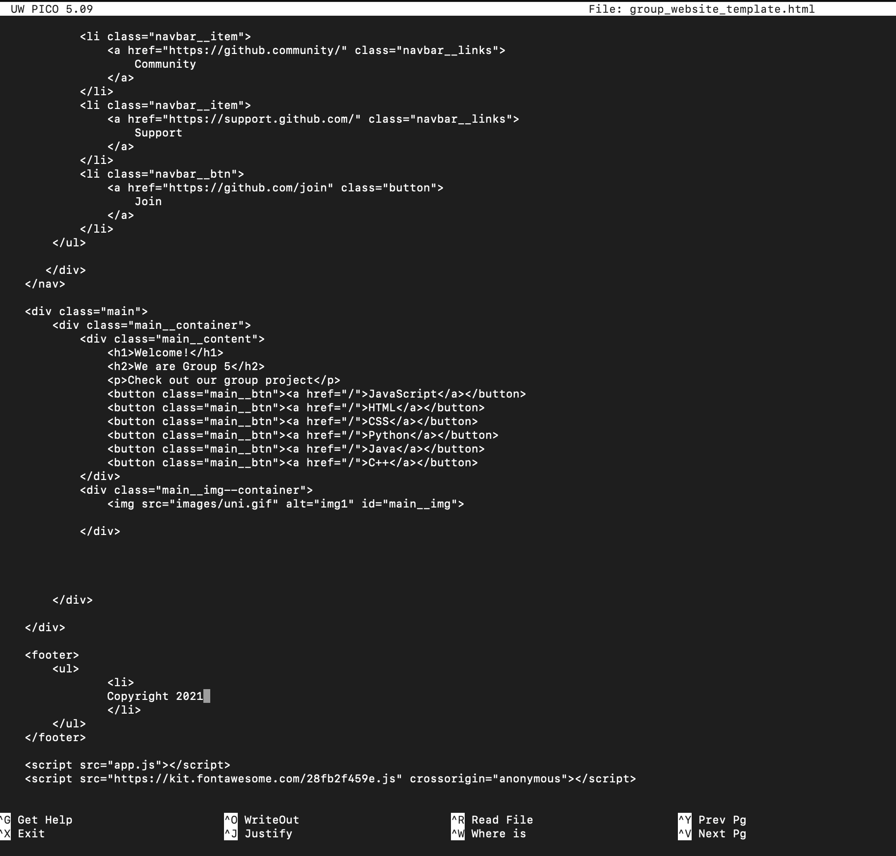
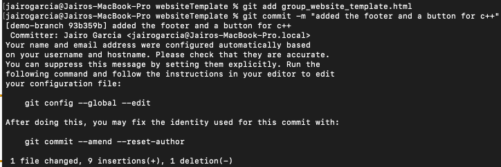
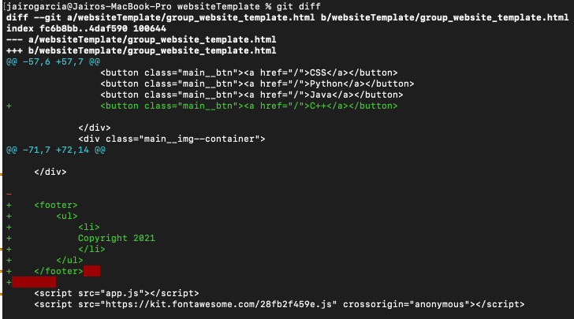
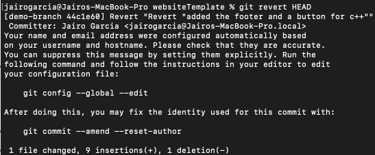
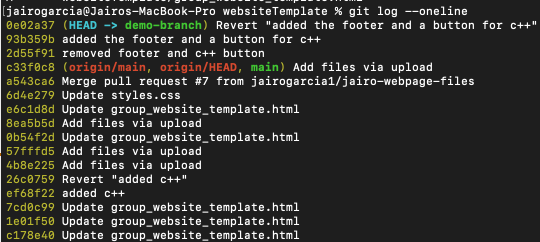
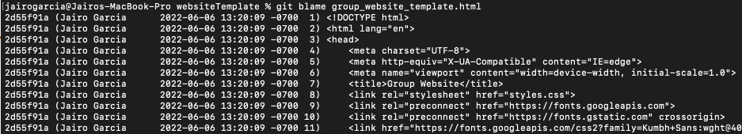
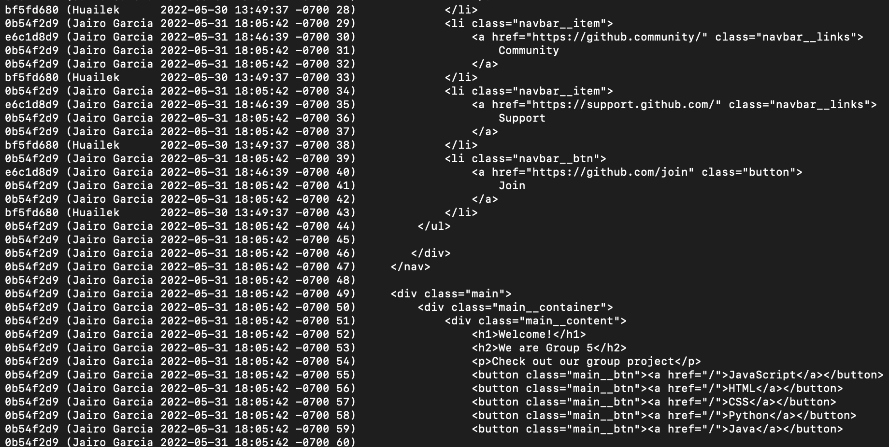
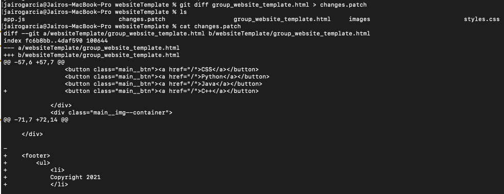
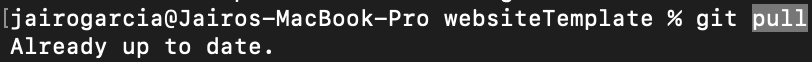

# Practice in Class 8: Diff, rollback, blame, patching code, updates 
## Branch the project into different branches  (see example below) 
 
 

## and then make a small change. (adding a button for "c++" and a footer at the end) 
 
## add and commit the changes. (adding a button for "c++" and a footer at the end) 
 
 

## Run git diff (or some version of git diff) to determine the differences in the two branches. (see example below) 
 
 

## To reverse the last change that was made use the "git revert" command (see example below)  
 
 

## to check log for reversed changes use the "git log" command (see example below)  
 
 

## To find out who made a change to your group's project use "git blame" (see example below)  

 
 

## to create a git patch file use "git diff" command and copy all changes to the patch file (see example below)  
 
 

## To update your local repository with the latest version of the group project code use the "git pull" command (see example below)  
 
 

## The local repository is up to date so no changes are made. 
